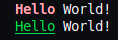

# LogMod

LogMod is a lightweight, flexible logging library for C applications that supports multiple severity levels, custom labels, thread-safety, and colored output. It's designed to be easy to integrate with zero dynamic memory allocation, supporting both C89 and C99 standards through a single-header implementation.

## Table of Contents
- [Features](#features)
- [Build](#build)
- [Fallback Logger](#fallback-logger)
- [Usage](#usage)
  - [Initialization](#initialization)
  - [Retrieving Loggers](#retrieving-loggers)
  - [Logging Messages](#logging-messages)
  - [Custom Log Labels](#custom-log-labels)
  - [Color Support](#color-support)
    - [ANSI Color Formatting](#ansi-color-formatting)
  - [Thread Safety](#thread-safety)
  - [Custom Logging Callback](#custom-logging-callback)
  - [LogMod Options](#logmod-options)
  - [Cleanup](#cleanup)
- [C89 vs C99 Support](#c89-vs-c99-support)
- [API Reference](#api-reference)
  - [logmod_init](#logmod_init)
  - [logmod_cleanup](#logmod_cleanup)
  - [logmod_get_logger](#logmod_get_logger)
  - [logmod_set_lock](#logmod_set_lock)
  - [logmod_encode](#logmod_encode)
  - [logmod_logger_set_callback](#logmod_logger_set_callback)
  - [logmod_logger_set_data](#logmod_logger_set_data)
  - [logmod_logger_set_options](#logmod_logger_set_options)
  - [logmod_logger_set_id_visibility](#logmod_logger_set_id_visibility)
  - [logmod_logger_set_quiet](#logmod_logger_set_quiet)
  - [logmod_logger_set_color](#logmod_logger_set_color)
  - [logmod_logger_set_logfile](#logmod_logger_set_logfile)
  - [logmod_logger_get_counter](#logmod_logger_get_counter)
  - [logmod_logger_get_label](#logmod_logger_get_label)
  - [logmod_logger_get_level](#logmod_logger_get_level)
  - [logmod_logger_set_level](#logmod_logger_set_level)
  - [logmod_set_options](#logmod_set_options)
  - [logmod_toggle_logger](#logmod_toggle_logger)
- [License](#license)

## Features

- Zero dynamic-allocation
- Initialize logging context with application ID and logger table.
- Retrieve or create loggers by context ID.
- Log messages with different severity levels (TRACE, DEBUG, INFO, WARN, ERROR, FATAL).
- Support for custom log labels for application-specific logging needs.
- Custom callback support for advanced logging scenarios.
- Thread-safe logging with custom lock functions.
- Optionally log messages to a file.
- ANSI color support for terminal output.
- Compatible with both C89 and C99 standards.
- Single header file implementation for easy integration.

## Build

LogMod is single-header-only library, so it includes additional macros for more complex uses cases. `#define LOGMOD_STATIC` hides all LogMod API symbols by making them static. Also, if you want to include `logmod.h` from multiple C files, to avoid duplication of symbols you may define `LOGMOD_HEADER` macro.

```c
/* In every .c file that uses LogMod include only declarations: */
#define LOGMOD_HEADER
#include "logmod.h"

/* Additionally, create one logmod.c file for LogMod implementation: */
#include "logmod.h"
```

## Fallback Logger

LogMod provides a global fallback logger that is automatically used when:

1. You pass `NULL` as the logger parameter to logging functions
2. You want to log something before initializing your own logging context

This allows for immediate logging without explicit setup:

```c
// Log using the fallback logger (no need to initialize anything)
logmod_log(INFO, NULL, "This uses the fallback logger");
```

The fallback logger uses:
- Application ID: Defined by `LOGMOD_FALLBACK_APPLICATION_ID` (defaults to "APPLICATION")
- Context ID: Defined by `LOGMOD_FALLBACK_CONTEXT_ID` (defaults to "GLOBAL")

You can customize these values by defining them before including logmod.h:

```c
#define LOGMOD_FALLBACK_APPLICATION_ID "MY_APP"
#define LOGMOD_FALLBACK_CONTEXT_ID "DEFAULT"
#include "logmod.h"
```

This feature is particularly useful during application startup or in code that doesn't have easy access to a logger instance.

## Usage

### Initialization

To initialize the logging context, use the `logmod_init` function:

```c
#include "logmod.h"

struct logmod logmod;
struct logmod_logger table[5]; // Pre-allocated array to store logger instances

logmod_err code = logmod_init(&logmod, "APPLICATION_ID", table, 5);
if (code != LOGMOD_OK) {
    // Handle error
}
```

The `table` parameter is an array of `struct logmod_logger` that LogMod uses to store all logger instances. You need to pre-allocate this array with enough space for the maximum number of loggers your application will use (5 in this example). The `length` parameter specifies the capacity of this array.

### Retrieving Loggers

To retrieve or create a logger by context ID, use the `logmod_get_logger` function:

```c
struct logmod_logger *logger = logmod_get_logger(&logmod, "CONTEXT_ID");
if (logger == NULL) {
    // Handle error
}
```

### Logging Messages

LogMod provides two main macros for logging messages, one for C89 compatibility and another for C99:

#### For C99 and later:

```c
// Log messages with different severity levels
logmod_log(TRACE, logger, "This is a trace message");
logmod_log(DEBUG, logger, "This is a debug message with a value: %d", 42);
logmod_log(INFO, logger, "This is an info message with multiple values: %s, %d", "test", 123);
```

#### For C89 compatibility:

```c
// Log messages with different severity levels using tuple syntax for C89 compatibility
logmod_nlog(TRACE, logger, ("This is a trace message"), 0);
logmod_nlog(DEBUG, logger, ("This is a debug message with a value: %d", 42), 1);
logmod_nlog(INFO, logger, ("This is an info message with multiple values: %s, %d", "test", 123), 2);
```

The last parameter in the C89 version (`logmod_nlog`) indicates the number of arguments in the format string (excluding the format string itself).

### Custom Log Labels

LogMod allows you to define custom log labels for application-specific logging needs. Custom log labels must start with level `LOGMOD_LEVEL_CUSTOM`.

Here's how to define and use custom log labels:

```c
// Define custom log labels's levels
enum {
    LOGMOD_LEVEL_HTTP = LOGMOD_LEVEL_CUSTOM,
    LOGMOD_LEVEL_TESTMODE
};

// Define custom log label properties (name, color, style, output stream)
static const struct logmod_label custom_labels[] = {
    // Name, Color code, Style code, Output stream (0=stdout, 1=stderr)
    { "HTTP", LOGMOD_LABEL_COLOR(BLUE, REGULAR, FOREGROUND), 0 },
    { "TEST", LOGMOD_LABEL_COLOR(MAGENTA, BOLD, INTENSITY),  0 }
};

// Register custom labels with your logger
logmod_logger_set_callback(logger, custom_labels, 2, my_callback);

// Use your custom log labels
logmod_log(HTTP, logger, "HTTP request received: %s", request_url);
logmod_log(TESTMODE, logger, "Test mode activated");
```

When using custom log labels, you need to:
1. Define enum values starting at `LOGMOD_LEVEL_CUSTOM`
2. Create a const static array of `logmod_label` structures defining the properties for each label
3. Register these labels with your logger using `logmod_logger_set_callback`
4. Use the label names with the logging macros just like built-in levels

The callback you provide will be invoked for all log messages, allowing you to implement custom handling for your specific log labels.

### Color Support

By default, LogMod outputs colored log messages to the terminal. Each log level has a distinct color to help quickly identify message types:

- TRACE: Blue (intensity)
- DEBUG: Cyan
- INFO: Green
- WARN: Yellow
- ERROR: Red
- FATAL: Magenta

You can enable or disable colored output for a logger:

```c
// Enable colored output
logmod_logger_set_color(logger, 1);

// Disable colored output
logmod_logger_set_color(logger, 0);
```

#### ANSI Color Formatting

LogMod provides macros for ANSI color formatting of arbitrary text. These macros make it easy to add colors and styles to your console output in different contexts.

##### LML - Logger-Based Color Formatting

`LML` (shorthand for `LOGMOD_ENCODE_LOGGER`) automatically respects the logger's color settings. Colors are only applied if the logger has colors enabled.

```c
// Syntax: LML(logger, text, color, style, visibility)
// Example:
logmod_logger_set_color(logger, 1); // Enable color for this logger
printf("%s World!\n", LML(logger, "Hello", RED, BOLD, FOREGROUND));

// If colors are disabled in the logger, no colors will be applied
logmod_logger_set_color(logger, 0);
printf("%s World!\n", LML(logger, "Hello", RED, BOLD, FOREGROUND)); // Outputs without color
```

##### LMS - Static Color Formatting

`LMS` (shorthand for `LOGMOD_ENCODE_STATIC`) always applies the specified color regardless of any logger settings. This is useful for consistent colored output independent of logging configuration.

```c
// Syntax: LMS(text, color, style, visibility)
// Example:
printf(LMS("Hello", GREEN, UNDERLINE, FOREGROUND) " World!\n");

// Always outputs colored text, regardless of any logger settings
```

##### LME - Raw Encoding

`LME` (shorthand for `LOGMOD_ENCODE`) provides the most flexibility by allowing dynamic settings for all fields. This macro accepts raw ANSI color codes without the enum prefix.

```c
// Syntax: LME(text, color_code, style_code, visibility_code)
// Example:
printf(LME("%s", LOGMOD_COLOR_BLUE, LOGMOD_STYLE_REGULAR, LOGMOD_VISIBILITY_BACKGROUND) "World!", "Hello");

// For dynamic values, you can pass variables containing the codes
const char* my_color = LOGMOD_COLOR_RED;
printf(LME("Warning", my_color, LOGMOD_STYLE_BOLD, LOGMOD_VISIBILITY_FOREGROUND) "!\n");
```

##### LMT - Toggle-Based Color Formatting

`LMT` (shorthand for `LOGMOD_ENCODE_TOGGLE`) provides conditional color formatting based on a boolean toggle. Colors are only applied if the toggle is true.

```c
// Syntax: LMT(toggle, text, color, style, visibility)
// Example:
int enable_colors = 1;
printf("%s World!\n", LMT(enable_colors, "Hello", MAGENTA, UNDERLINE, BACKGROUND_INTENSITY));

// Disable colors with the toggle
enable_colors = 0;
printf("%s World!\n", LMT(enable_colors, "Hello", MAGENTA, UNDERLINE, BACKGROUND_INTENSITY)); // Outputs without color
```

When properly configured, these macros should print colored text to the console like this:



Available colors, styles, and visibility options:

```c
// Colors (used without the LOGMOD_COLOR_ prefix)
BLACK, RED, GREEN, YELLOW, BLUE, MAGENTA, CYAN, WHITE

// Styles (used without the LOGMOD_STYLE_ prefix)
REGULAR, BOLD, UNDERLINE, STRIKETHROUGH

// Visibility (used without the LOGMOD_VISIBILITY_ prefix)
FOREGROUND, BACKGROUND, INTENSITY, BACKGROUND_INTENSITY
```

The color formatting macros automatically add the necessary prefixes, so you can use the enum values directly without their prefixes.

### Thread Safety

To make logging thread-safe, you can set a custom lock function:

```c
void my_lock_function(const struct logmod_logger *logger, int should_lock) {
    // Implementation of your lock mechanism
    // should_lock == 1: acquire lock
    // should_lock == 0: release lock
}

// Set the lock function
logmod_set_lock(&logmod, my_lock_function);
```

### Custom Logging Callback

You can set a custom callback for advanced logging scenarios:

```c
logmod_err my_callback(
    const struct logmod_logger *logger,
    const struct logmod_info *info,
    const char *fmt,
    va_list args) 
{
    // Get user data associated with this logger
    void *user_data = logger->user_data;
    
    // Check if it's a custom label
    if (info->level >= LOGMOD_LEVEL_CUSTOM) {
        // Handle custom log labels
        // ...
    }
    
    // Custom logging implementation
    return LOGMOD_OK;  // Stop default logging behavior
    // OR
    return LOGMOD_OK_CONTINUE;  // Continue with default logging
}

// Set the callback with custom labels
size_t num_custom_labels = sizeof(custom_labels) / sizeof *custom_labels;
logmod_logger_set_callback(logger, custom_labels, num_custom_labels, my_callback);

// Set user data separately if needed
logmod_logger_set_data(logger, my_user_data);
```

#### Callback Return Values

Your callback function should return one of these values:

- `LOGMOD_OK`: Indicates the callback has fully handled the log message, and the default logging functionality should be skipped (no console or file output).
- `LOGMOD_OK_CONTINUE`: Indicates the callback has processed the message but wants the default logging behavior (console/file output) to continue afterward. This is useful when you want to augment rather than replace the standard logging.
- Any other error code: If your callback returns any other error code, logging will stop and the error will be propagated to the caller.

This flexibility allows you to implement callbacks that can either:
- Completely replace the default logging
- Perform additional actions before normal logging continues
- Filter or transform messages before they're written to console/file

### LogMod Options

You can configure various options for your logger:

```c
// Set all options at once
struct logmod_options options = {
    .logfile = fopen("app.log", "a"),
    .quiet = 0,
    .color = 1
};

// Set default options for all loggers
logmod_set_options(&logmod, options);

// Set options for a specific logger
logmod_logger_set_options(logger, options);

// Or set individual options
logmod_logger_set_quiet(logger, 0);     // Enable console output
logmod_logger_set_color(logger, 1);     // Enable colored output
logmod_logger_set_logfile(logger, fp);  // Set log file
logmod_logger_set_id_visibility(logger, 1, 1);  // Show both application ID and context ID
```

### Cleanup

To clean up the logging context, use the `logmod_cleanup` function:

```c
logmod_cleanup(&logmod);
```

## C89 vs C99 Support

LogMod is designed to be compatible with both C89 and C99 standards. The key differences are:

### Variable Arguments in Macros

C99 introduced support for variable arguments in macros using `__VA_ARGS__`. LogMod provides two versions of its logging macros:

1. **C99 version** (`logmod_log`): Uses variadic macros for a cleaner syntax:
   ```c
   logmod_log(INFO, logger, "Value: %d", 42);
   ```

2. **C89 version** (`logmod_nlog`): Uses a tuple-based approach with an additional parameter to specify the number of arguments:
   ```c
   logmod_nlog(INFO, logger, ("Value: %d", 42), 1);
   ```

The C89 version uses the `LOGMOD_SPREAD_TUPLE_X` macros internally to unpack the tuple of arguments in a standard-compliant way.

## API Reference

### `logmod_init`

```c
logmod_err logmod_init(struct logmod *logmod, const char *const app_id, struct logmod_context table[], unsigned length);
```

Initializes the logging context with the specified application ID and logger table.
- `logmod`: Pointer to the logging context structure.
- `app_id`: Application ID string.
- `table`: Logger table array.
- `length`: Length of the logger table array.

Returns `LOGMOD_OK` on success, or an error code on failure.

### `logmod_cleanup`

```c
logmod_err logmod_cleanup(struct logmod *logmod);
```

Cleans up the logging context.
- `logmod`: Pointer to the logging context structure.
Returns `LOGMOD_OK` on success

### `logmod_get_logger`

```c
struct logmod_logger *logmod_get_logger(struct logmod *logmod, const char *const context_id);
```

Retrieves or creates a logger by context ID.
- `logmod`: Pointer to the logging context structure.
- `context_id`: Context ID string.
Returns a pointer to the logger, or `NULL` on failure.

### `logmod_set_lock`

```c
logmod_err logmod_set_lock(struct logmod *logmod, logmod_lock lock);
```

Sets the lock function for shared resources between loggers.
- `logmod`: Pointer to the logging context structure.
- `lock`: Lock function pointer of type `logmod_lock`.

### `logmod_logger_set_callback`

```c
logmod_err logmod_logger_set_callback(
    struct logmod_logger *logger,
    const struct logmod_label *const custom_labels,
    const size_t num_custom_labels,
    logmod_callback callback);
```

Sets a custom callback function for the logger.
- `logger`: Pointer to the logger structure.
- `custom_labels`: Custom log labels, or NULL to use defaults. When providing custom labels, they must correspond to enum values starting at `LOGMOD_LEVEL_CUSTOM`.
- `num_custom_labels`: Number of custom labels.
- `callback`: Callback function of type `logmod_callback`.

### `logmod_logger_set_data`

```c
logmod_err logmod_logger_set_data(struct logmod_logger *logger, void *user_data);
```

Sets the user data to be associated with the logger. This data can be accessed through the logger in the callback function.
- `logger`: Pointer to the logger structure.
- `user_data`: Pointer to user-defined data.
Returns `LOGMOD_OK` on success.

### `logmod_logger_set_options`

```c
logmod_err logmod_logger_set_options(struct logmod_logger *logger, struct logmod_options options);
```

Sets the options for the logger.
- `logger`: Pointer to the logger structure.
- `options`: Logger options structure.

### `logmod_logger_set_id_visibility`

```c
logmod_err logmod_logger_set_id_visibility(struct logmod_logger *logger, int show_app_id, int show_context_id);
```

Controls the visibility of application ID and context ID in log messages.
- `logger`: Pointer to the logger structure.
- `show_app_id`: Set to 1 to show the application ID in log messages, 0 to hide it.
- `show_context_id`: Set to 1 to show the context ID in log messages, 0 to hide it.
Returns `LOGMOD_OK` on success, error code on failure.

```c
// Examples:
// Show both application ID and context ID
logmod_logger_set_id_visibility(logger, 1, 1);

// Hide application ID, show context ID (default behavior)
logmod_logger_set_id_visibility(logger, 0, 1);

// Show application ID, hide context ID
logmod_logger_set_id_visibility(logger, 1, 0);

// Hide both application ID and context ID
logmod_logger_set_id_visibility(logger, 0, 0);
```

This setting affects how messages are formatted when displayed in the console or written to a log file. Showing the application ID is useful in multi-application environments, while showing the context ID helps identify the source module within your application.

### `logmod_logger_set_quiet`

```c
logmod_err logmod_logger_set_quiet(struct logmod_logger *logger, int quiet);
```

Sets the quiet mode for the logger.
- `logger`: Pointer to the logger structure.
- `quiet`: Quiet mode flag (1 to enable, 0 to disable).
Returns `LOGMOD_OK` on success.

### `logmod_logger_set_color`

```c
logmod_err logmod_logger_set_color(struct logmod_logger *logger, int color);
```

Sets the color mode for the logger.
- `logger`: Pointer to the logger structure.
- `color`: Color mode flag (1 to enable, 0 to disable).
Returns `LOGMOD_OK` on success.

### `logmod_logger_set_logfile`

```c
logmod_err logmod_logger_set_logfile(struct logmod_logger *logger, FILE *logfile);
```

Sets the logfile for the logger.
- `logger`: Pointer to the logger structure.
- `logfile`: Logfile pointer.
Returns `LOGMOD_OK` on success.

### `logmod_logger_get_counter`

```c
unsigned logmod_logger_get_counter(const struct logmod_logger *logger);
```

Retrieves the global log message counter shared between all loggers from the same `logmod` instance. This counter increments each time a message is logged through any logger associated with the parent logmod instance.
- `logger`: Pointer to the logger structure.
Returns the current value of the shared counter.

The counter is thread-safe when a lock function is provided via `logmod_set_lock()`. This function can be useful for:
- Generating unique message IDs
- Tracking how many messages have been logged globally
- Implementing sequencing or correlation between different log contexts

```c
// Example: Get current message count
unsigned msg_count = logmod_logger_get_counter(logger);
printf("Total logs so far: %u\n", msg_count);
```

### `logmod_logger_get_label`

```c
const struct logmod_label *const logmod_logger_get_label(
    const struct logmod_logger *logger, const unsigned level);
```

Retrieves the label information for a specific logging level.
- `logger`: Pointer to the logger structure.
- `level`: The logging level to get the label for (can be a built-in level or a custom level).
Returns a pointer to the label structure containing the name, color, and output specifications.

This function is useful for getting information about log levels, especially when working with custom log levels:

```c
// Get label for a built-in level
const struct logmod_label *info_label = logmod_logger_get_label(logger, LOGMOD_LEVEL_INFO);
printf("Info label name: %s\n", info_label->name);  // Outputs: "Info label name: INFO"

// Get label for a custom level
const struct logmod_label *http_label = logmod_logger_get_label(logger, LOGMOD_LEVEL_HTTP);
printf("Custom label name: %s\n", http_label->name);  // Outputs: "Custom label name: HTTP"
```

### `logmod_logger_get_level`

```c
long logmod_logger_get_level(const struct logmod_logger *logger, const char *const label);
```

Retrieves the level value for a specified label name. This is the reverse operation of `logmod_logger_get_label()`.
- `logger`: Pointer to the logger structure.
- `label`: The label name to search for (e.g., "INFO", "DEBUG", "HTTP").
Returns the level value as a long integer, or LOGMOD_BAD_PARAMETER if invalid.

This function is useful for converting label names to level values:

```c
// Get level for a built-in label
long info_level = logmod_logger_get_level(logger, "INFO");
if (info_level >= 0) {
    printf("INFO level value: %ld\n", info_level);  // Outputs: "INFO level value: 2"
}

// Get level for a custom label
long http_level = logmod_logger_get_level(logger, "HTTP");
if (http_level >= 0) {
    printf("HTTP level value: %ld\n", http_level);  // Value depends on your custom levels
}
```

### `logmod_logger_set_level`

```c
logmod_err logmod_logger_set_level(struct logmod_logger *logger, unsigned level);
```

Sets the minimum logging level for the logger. Messages with a level lower than this will be suppressed.
- `logger`: Pointer to the logger structure.
- `level`: Minimum level to log (e.g., LOGMOD_LEVEL_INFO will only show INFO, WARN, ERROR, and FATAL).
Returns `LOGMOD_OK` on success.

```c
// Examples:
// Only show warnings and more severe messages
logmod_logger_set_level(logger, LOGMOD_LEVEL_WARN);

// Show all messages including trace
logmod_logger_set_level(logger, LOGMOD_LEVEL_TRACE);

// Show only error and fatal messages
logmod_logger_set_level(logger, LOGMOD_LEVEL_ERROR);
```

### `logmod_set_options`

```c
logmod_err logmod_set_options(struct logmod *logmod, struct logmod_options options);
```

Sets the default options for all new loggers created from this logmod instance. This affects the baseline configuration for loggers retrieved with `logmod_get_logger()` after this call, but does not modify existing loggers.
- `logmod`: Pointer to the logging context structure.
- `options`: Options structure containing default settings for quiet mode, color support, log level, and log file.
Returns `LOGMOD_OK` on success.

```c
// Example: Configure default options for all new loggers
struct logmod_options default_opts = {
    .logfile = fopen("application.log", "a"),
    .quiet = 0,     // Show console output by default
    .color = 1,     // Enable colored output by default
    .level = LOGMOD_LEVEL_INFO  // Only show INFO and above by default
};
logmod_set_options(&logmod, default_opts);

// Any new loggers will inherit these settings
struct logmod_logger *new_logger = logmod_get_logger(&logmod, "NEW_MODULE");
// new_logger now has the default options set above
```

### `logmod_toggle_logger`

```c
logmod_err logmod_toggle_logger(struct logmod *logmod, const char *const context_id);
```

Toggles a specific logger from enabled to disabled or vice versa. When a logger is disabled, all logging operations through that logger will be skipped.
Note: this function can be called before the logger's `logmod_get_logger()` first call!

- `logmod`: Pointer to the logging context structure.
- `context_id`: Context ID string of the logger to toggle.
Returns `LOGMOD_OK` on success, error code on failure.

```c
// Examples:
// Disable a logger (if currently enabled)
logmod_toggle_logger(&logmod, "NETWORK");

// Later, re-enable the same logger
logmod_toggle_logger(&logmod, "NETWORK");
```

Disabled loggers will skip all logging operations and immediately return `LOGMOD_OK_SKIPPED`. This is useful for temporarily silencing specific logging contexts without removing the logging calls from your code.

## License

This project is licensed under the MIT License - see the [LICENSE](LICENSE) file for details.
